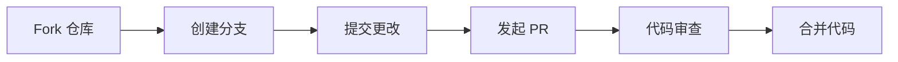

# 十周年 UI 扩展

<div align="center">


**为《无名杀》游戏提供现代化界面美化的扩展**

[](https://github.com/diandian157/decadeUI)
[](https://github.com/diandian157/decadeUI)
[](https://github.com/diandian157/decadeUI/issues)
[](https://github.com/diandian157/decadeUI/pulls)

</div>

---

## 📖 扩展介绍

十周年 UI 是一个为《无名杀》游戏提供现代化界面美化的扩展，致力于为玩家带来更好的游戏体验。该扩展基于原手杀 UI（界面美化）扩展开发，经过重新设计和优化，提供了更加美观和实用的游戏界面。

### 🎯 设计理念

-   **还原官方风格**：忠实还原官方局内的设计风格
-   **用户体验优先**：注重操作的流畅性和直观性
-   **兼容性保证**：与大多数无名杀扩展保持良好兼容

---

## ✨ 主要特性

### 🎨 界面美化

| 特性           | 描述                                       |
| -------------- | ------------------------------------------ |
| **现代化设计** | 还原官方局内的设计风格，提供统一的视觉体验 |
| **多布局支持** | 支持默认、手杀、新版等多种布局模式         |
| **响应式设计** | 适配不同屏幕尺寸和设备，自适应布局         |
| **动画效果**   | 丰富的交互动画和过渡效果，提升视觉体验     |

### 🎮 游戏体验优化

| 功能           | 优势                               |
| -------------- | ---------------------------------- |
| **单独装备栏** | 可选的独立装备显示区域，信息更清晰 |
| **手牌管理**   | 优化的手牌布局和操作体验           |
| **角色展示**   | 美化的角色信息显示，信息层次分明   |
| **技能标记**   | 清晰的技能状态指示，一目了然       |

### 🔧 功能增强

-   **自适应布局**：根据玩家数量自动调整界面布局
-   **触摸优化**：针对移动设备的触摸操作优化
-   **性能优化**：高效的渲染和更新机制
-   **兼容性**：与大多数无名杀扩展兼容

---

## 📦 安装说明

### 方法一：GitHub 下载

```bash
# 克隆仓库
git clone https://github.com/diandian157/decadeUI.git

# 将整个文件夹复制到无名杀的 extension 目录下
cp -r decadeUI/ 无名杀安装目录/extension/十周年UI/
```

### 方法二：手动下载

```bash
1. 访问 [GitHub 仓库](https://github.com/diandian157/decadeUI)
2. 点击 `Releases` → `Source code`
3. 打开游戏设置里的自动导入扩展开关
4. 解压后将整个 `十周年UI` 文件夹复制到无名杀的 `extension` 目录下
5. 重启无名杀游戏
```

### ✅ 安装验证

安装完成后，您应该能够：

-   在游戏扩展列表中看到"十周年 UI"
-   在布局设置中看到新的布局选项
-   在扩展设置中看到相关配置项

## ⚙️ 配置选项

### 🎛️ 布局设置

在游戏选项 → 外观 → 布局中选择以下布局：

| 布局模式     | 推荐度     | 特点                   |
| ------------ | ---------- | ---------------------- |
| **新版布局** | ⭐⭐⭐⭐⭐ | 推荐使用，提供最佳体验 |
| 默认布局     | ⭐⭐⭐⭐   | 经典布局，稳定可靠     |
| 手杀布局     | ⭐⭐⭐     | 手杀风格，怀旧体验     |

### 🔧 扩展设置

在扩展设置中可以调整：

<details>
<summary><strong>界面设置</strong></summary>

-   **单独装备栏**：是否启用独立的装备显示区域
-   **动画效果**：控制界面动画的开启/关闭
-   **样式切换**：在多种风格样式下切换
-   **拖拽手牌**：手牌支持拖拽牌序

</details>

<details>
<summary><strong>性能设置</strong></summary>

-   **渲染优化**：开启/关闭高性能渲染模式
-   **动画帧率**：调整动画的流畅度
-   **内存管理**：优化内存使用

</details>

---

## 🎯 使用建议

### 💻 推荐配置

| 项目           | 推荐配置                            |
| -------------- | ----------------------------------- |
| **布局模式**   | 新版布局                            |
| **浏览器**     | Chrome 91+ 或基于 Chromium 的浏览器 |
| **屏幕分辨率** | 1920x1080 或更高                    |
| **设备**       | 桌面端或移动设备                    |

### 🔄 兼容性说明

-   ✅ 默认适配无名杀最新版本
-   ✅ 与大多数武将扩展和功能扩展兼容
-   ⚠️ 可能与某些美化扩展产生冲突

---

## 🐛 常见问题

<details>
<summary><strong>Q: 界面显示异常怎么办？</strong></summary>

**A:** 请确保使用推荐的布局模式，并检查浏览器版本是否满足要求。

**解决步骤：**

1. 检查浏览器版本是否为 Chrome 91+
2. 确认使用的是"新版布局"模式
3. 清除浏览器缓存后重试
4. 检查是否有其他扩展冲突

</details>

<details>
<summary><strong>Q: 与其他扩展冲突怎么办？</strong></summary>

**A:** 联系我或反馈冲突扩展作者修改达到适配。

**处理方法：**

1. 暂时关闭其他美化扩展
2. 在 GitHub Issues 中报告冲突
3. 提供详细的错误信息和扩展列表

</details>

<details>
<summary><strong>Q: 移动端体验如何？</strong></summary>

**A:** 虽然支持移动端，但推荐在桌面端使用以获得最佳体验。

**移动端特点：**

-   ✅ 支持触摸操作
-   ✅ 响应式布局适配
-   ⚠️ 部分功能可能受限
-   💡 建议使用平板设备

</details>

<details>
<summary><strong>Q: 如何更新到最新版本？</strong></summary>

**A:** 建议定期检查 GitHub 仓库获取最新版本。

**更新步骤：**

1. 备份当前的扩展文件夹
2. 下载最新版本并替换原文件夹
3. 清除浏览器缓存
4. 重启游戏

</details>

<details>
<summary><strong>Q: 扩展设置在哪里？</strong></summary>

**A:** 在游戏主界面可以找到扩展设置选项。

**设置位置：**

-   游戏主界面 → 扩展 → 十周年 UI → 设置
-   或者：游戏选项 → 扩展 → 十周年 UI

</details>

<details>
<summary><strong>Q: 支持哪些浏览器？</strong></summary>

**A:** 推荐使用现代浏览器以获得最佳体验。

**浏览器支持：**

-   ✅ Chrome 91+（推荐）
-   ✅ Edge 91+
-   ✅ Firefox 89+
-   ⚠️ Safari 14+（部分功能可能受限）
-   ❌ 不支持 IE 浏览器

</details>

---

## 🤝 贡献指南

### 📝 如何贡献



1. **Fork 本仓库**
2. **创建功能分支**：`git checkout -b feature/新功能`
3. **提交更改**：`git commit -m "添加新功能"`
4. **发起 Pull Request**

### 🛠️ 开发环境

**技术要求：**

-   ✅ 了解 HTML/CSS/JavaScript
-   ✅ 熟悉无名杀扩展开发规范
-   ✅ 建议关闭其他美化扩展进行测试

**开发工具：**

-   代码编辑器：VS Code、WebStorm 等
-   浏览器：Chrome DevTools
-   版本控制：Git

---

## 📄 许可证

本项目采用 **GPL-3.0** 许可证，详情请查看 [LICENSE](LICENSE) 文件。

<div align="center">

**欢迎提交问题报告和功能建议！**

</div>

---

## 🙏 致谢人员

<div align="center">

**排名不分先后，感谢所有为十周年 UI 做出贡献的朋友们！**

</div>

### 🌟 贡献者名单

<div align="center">

感谢以下朋友为十周年 UI 项目做出的贡献：

<br>

**@mengxinzxz** • **@xizifu** • **U** • **小爱莉** • **扶苏** • **小曦** • **@yx-lingmeng** • **无名** • **@rebirth-of-I-am** • **柴油鹿鹿**

<br>

<div style="display: flex; flex-wrap: wrap; justify-content: center; gap: 10px; margin: 20px 0;">


</div>

</div>

### 👨‍💻 原作者

| 角色         | 贡献者 | 贡献内容                    |
| ------------ | ------ | --------------------------- |
| **原创作者** | 短歌   | 十周年 UI 的原创设计        |
| **UI 基础**  | 橙续缘 | 手杀 UI（界面美化）的原作者 |

### 🔧 维护者

| 阶段           | 维护者         | 状态       |
| -------------- | -------------- | ---------- |
| **原维护者**   | 萌新（转型中） | 已移交     |
| **当前维护者** | 点点           | 活跃维护中 |

### 🌟 社区贡献

<div align="center">

感谢所有为无名杀社区做出贡献的开发者们！

**💝 特别感谢每一位使用和支持十周年 UI 的玩家！**

</div>

---

## 🔗 相关链接

<div align="center">

| 项目       | 链接                                                                           | 描述       |
| ---------- | ------------------------------------------------------------------------------ | ---------- |
| **无名杀** | [GitHub 仓库](https://github.com/libnoname/noname/tree/master)                 | 游戏本体   |
| **客户端** | [下载地址](https://github.com/libnoname/noname/releases/tag/chromium91-client) | 官方客户端 |

</div>

---

<div align="center">

**⚠️ 注意**：本扩展仅供学习和娱乐使用，请遵守相关法律法规和游戏规则。

**⭐ 如果这个项目对您有帮助，请给我们一个星标！**

</div>
